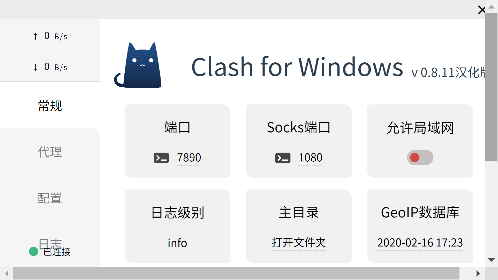

---
layout:     post  
title:      代理软件推荐
subtitle:   科学上网    
date:       2020-02-28  
author:     techkang  
header-img: img/google.jpg  
catalog: true  
tags:  
    - proxy
---  

## 介绍

最近使用了一款代理软件，颜值使用体验俱佳，强烈推荐一下。

## clash

该代理软件名为clash，下载地址：[clash_for_windows](https://github.com/Fndroid/clash_for_windows_pkg/releases)。

## 优势

clash运行界面如图所示，可以看出，其第一个优势是颜值高，而且重要信息一目了然。

当然，作为程序员，即使是命令行界面也能接受，但其第二个优势极为重要，即既支持socks5代理，也支持http代理。图中http代理端口号为7890，socks5代理端口号为1080。

支持两种代理协议的优势是，有些软件可能仅支持一种协议。例如Android Studio，在下载SDK包时是从谷歌官网下载，可以任选http协议或socks5协议。但是在build时连接dl.google.com时，仅支持使用http协议的代理，而常见的大多数代理软件，都仅支持socks5协议。